# 🚧 Work in Progress (W.I.P.) — Dungeon Of RO

### Premise
Dungeon Of RO is a simple Command-Line Interface (CLI) game built with C++, where the player is trapped inside a mysterious cave. To survive, the player must fight enemies and make use of the resources available inside the cave.

### Why Did I Create This?
> Because this was a task given to me to create a program using classes, and I really like RPG games.

### Is It Playable Now?
> Short answer: yes.

### But Is It Fun and Challenging?
> Sadly, for now, the answer is no. There are still a lot of things that I need to figure out and fix.

### What About the Source Code?
> There is a lot of mess inside my code because I'm writing it alone, and I still need to clean it up. There are a lot of objects, classes, and functions everywhere.

### Did You Use AI?
> Short answer: yes. I only asked AI how to change text colors and for help translating my README.md because I'm not very confident in my English skills.

### Did I Complete My Task?
> If we're talking about our task in Module One, I think I completed it by creating a game with a player and enemies (for now, they're not that smart). I'm also using OOP when creating the game, as required by the task.

### But Did I Complete My Game?
> For now, I'm not satisfied with my game. There are a lot of things that I can improve, such as adding new features and so on. But for now, the main objective of the game has been completed.

### What Was the Hardest Part While Creating This?
> ASCII art. Sorry for the bad drawings :) Also, figuring out when to use classes and when not to. For now, I'm still bad at this.

### Is It Compatible with Windows, macOS, Different Linux Versions, or Different C++ Versions?
> I'm not sure.

## Here Are Some Screenshots of My Game

#### First Look
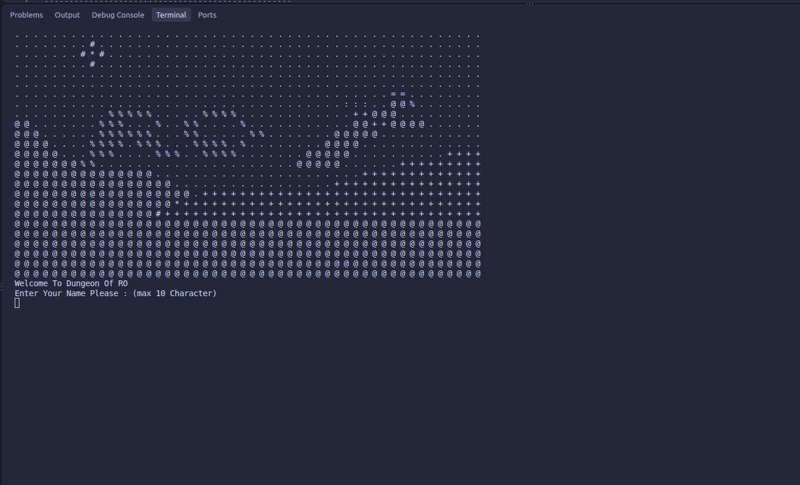

#### Prologue
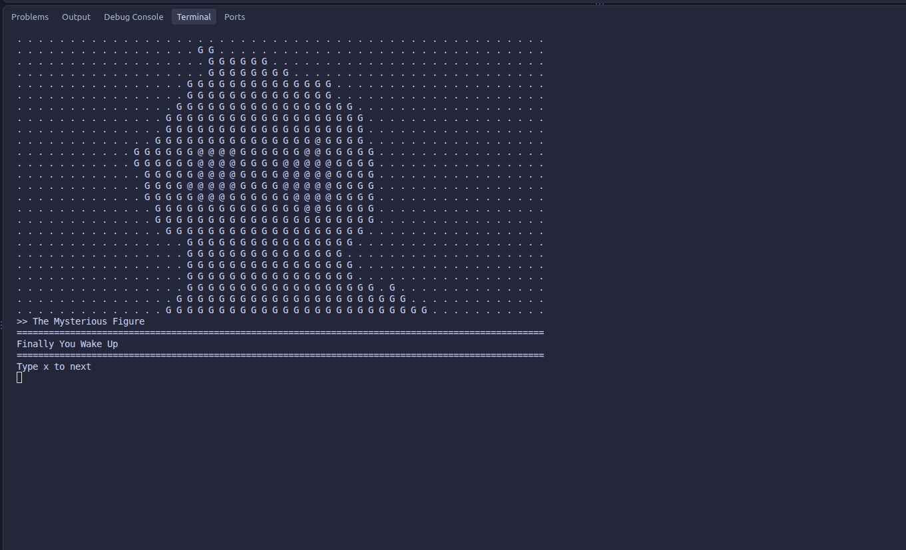

#### Game with Filter On
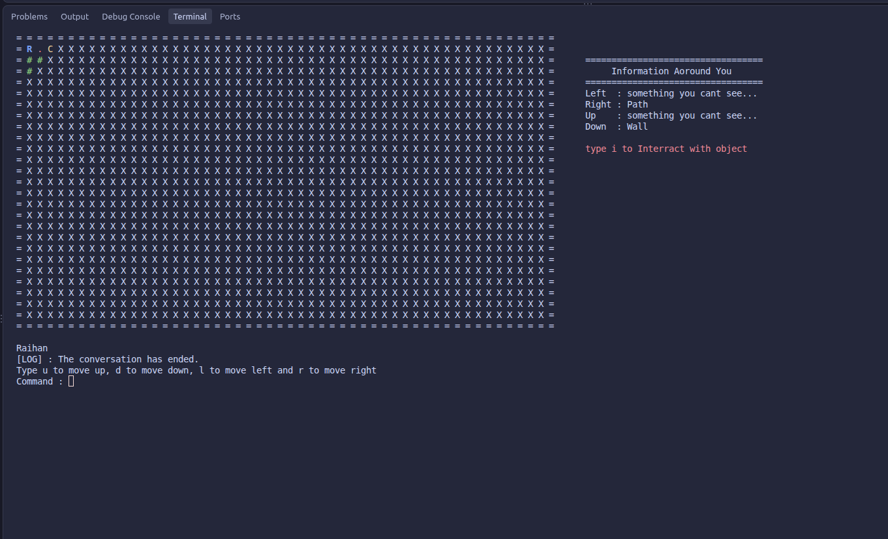

#### Game with Filter Off
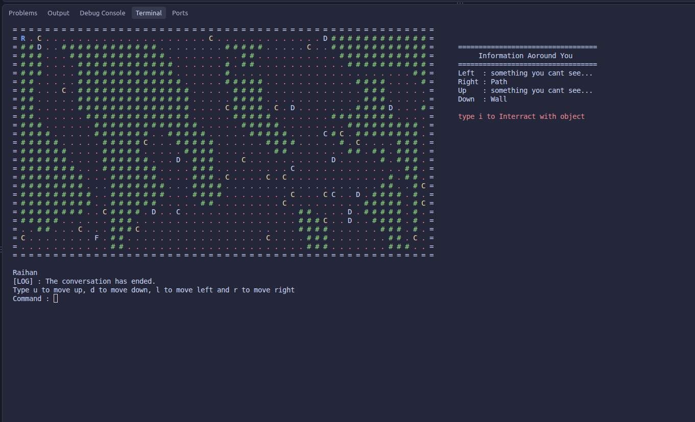

#### When the Player Opens a Chest
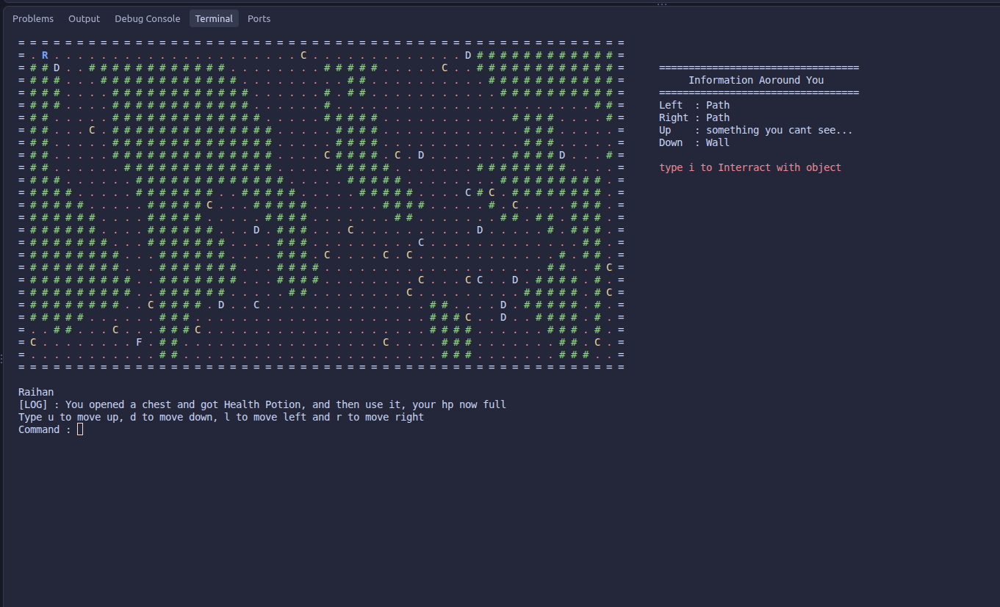

#### Interactive Dialogue with Choices
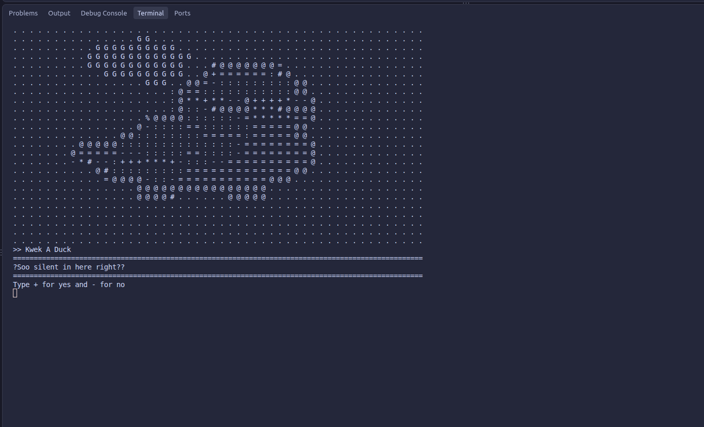

#### Battle Scene
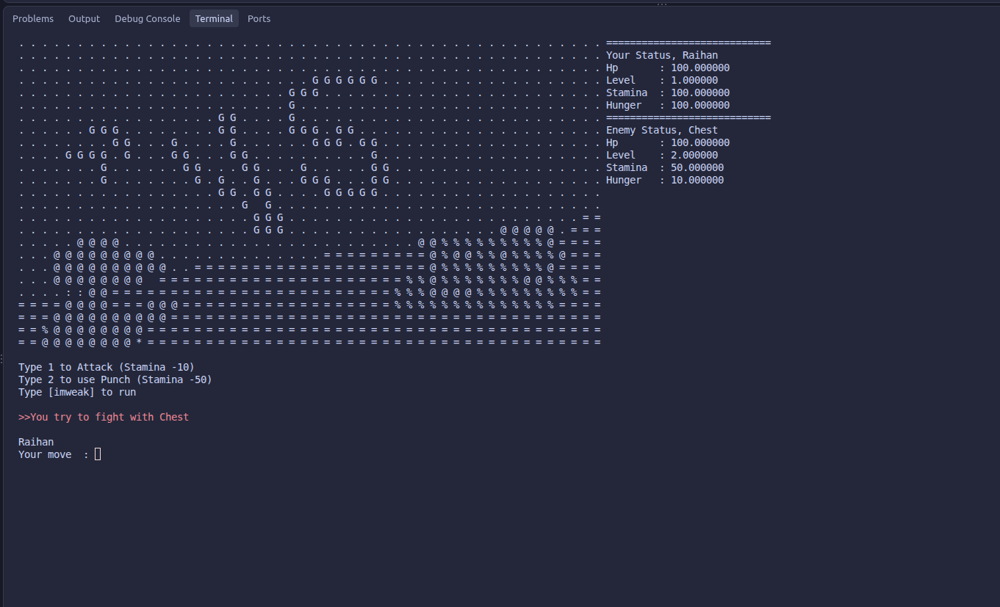

#### One of the Three Different Endings
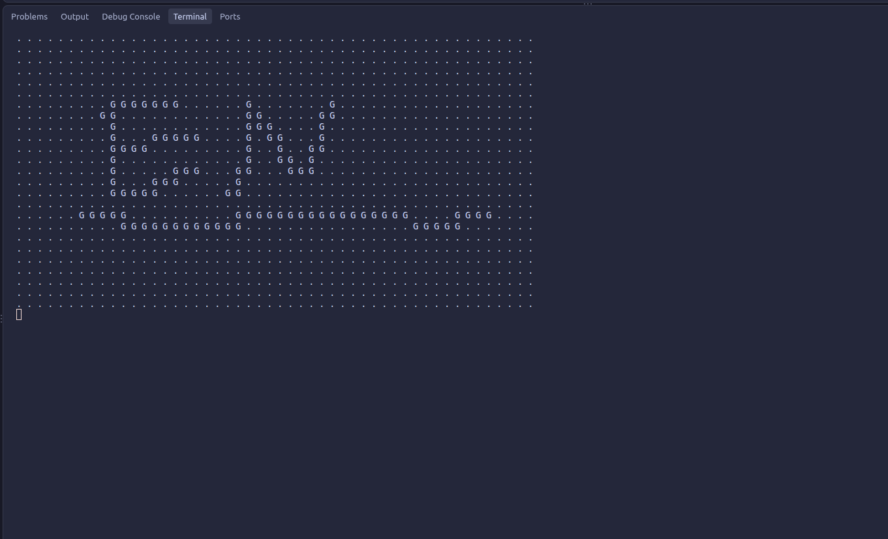

#### Different Maps Every Time the Game Opens
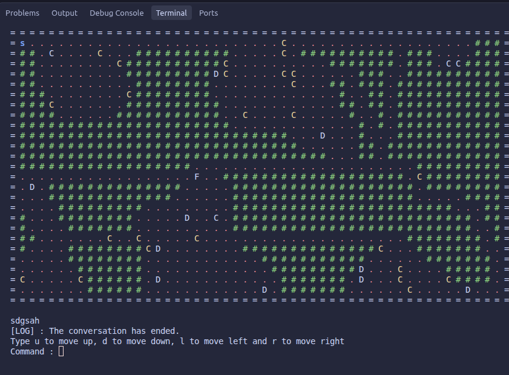

#### Game Over Scene After Losing a Battle
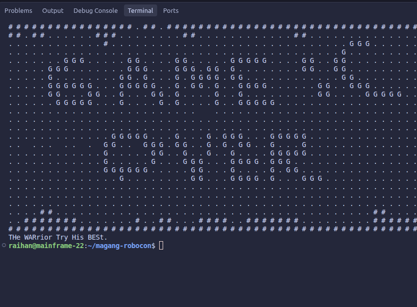

#### The End of the Game (No Matter Which Ending You Get)
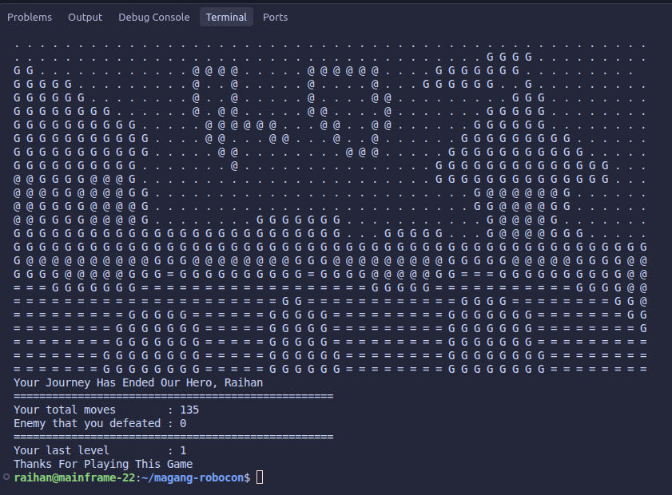

## 📊 Feature Progress

| # | **Feature** | **Status** |
|:--:|:---|:--:|
| 1 | Randomly generate caves | ✅ |
| 2 | Ensure every room is reachable | ✅ |
| 3 | Randomly place objects in valid positions inside the cave | ✅ |
| 4 | Randomly spawn enemies inside the cave | ✅ |
| 5 | Allow players to enter their names | ✅ |
| 6 | Allow players to move in four directions | ✅ |
| 7 | Allow players to interact with objects | ✅ |
| 8 | Allow players to battle enemies | ✅ |
| 9 | Allow players to win or lose battles against enemies | ✅ |
| 10 | Increase the player's level after winning a battle | ❌ |
| 11 | Allow players to use items | ❌ |
| 12 | Add an inventory system | ❌ |
| 13 | Allow players to use weapons | ❌ |
| 14 | Add advanced player skills | ❌ |
| 15 | Add unique skills for every enemy | ❌ |
| 16 | Implement smarter enemy AI during battles | ❌ |
| 17 | Implement an intelligent enemy spawning system | ❌ |
| 18 | Add a log system to record every player action | ❌ |
| 19 | Add a Game Over scene | ✅ |
| 20 | Add a Start scene | ✅ |
| 21 | Add a Battle scene | ✅ |
| 22 | Detect nearby objects around the player | ✅ |
| 23 | Add health potions | ❌ |
| 24 | Add objectives and quests | ❌ |
| 25 | Add NPCs | ✅ |
| 26 | Add a dialogue system | ✅ |
| 27 | Add a storyline | ❌ |
| 28 | Add multiple endings | ✅ |
| 29 | Add a Dialogue scene | ✅ |
| 30 | Represent the player with the first letter of their name | ✅ |
| 31 | Add interactive dialogue | ❌ |
| 32 | (Experimental) Hide unexplored areas of the map | ✅ |
| 33 | Add a punch skill for the player | ✅ |
| 34 | Add a defense skill for enemies | ✅ |
| 35 | Add static potions | ✅ |
| 36 | Make items a separate class from the object class | ✅ |
| 37 | Add a finish object and finish scene | ✅ |
| 38 | Add a running feature during battles | ✅ |
| 39 | Add global cutscenes | ✅ |
| 40 | Add a prologue | ✅ |
| 41 | Add an epilogue | ✅ |
| 42 | Add a stamina potion to recharge stamina | ✅ |
| 43 | Add a hunger feature | ❌ |
| 44 | Add insanity | ❌ |

And so on.

## 📈 Development Summary

| **Metric** | **Count** |
|:---|:---:|
| 📋 Total Features | 44 |
| ✅ Completed | 29 |
| ❌ Incomplete | 15 |
| 📊 Completion Rate | 65.91% |
| ⏳ Remaining | 34.09% |